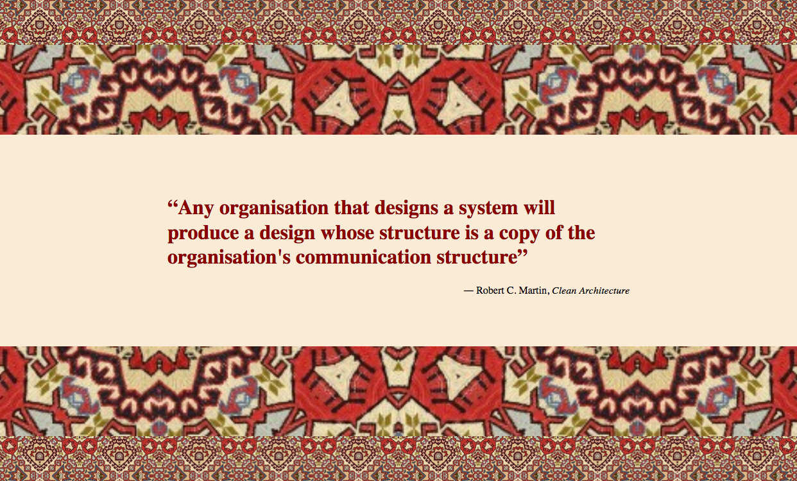

# Hintergrund-Muster

Lass uns eine einfache Seite erstellen, die ein Zitat anzeigt!
Zwei Muster umgeben das Zitat. Die Zitate sind so angeordnet, dass das obere das untere spiegelt.

Wirf einen Blick auf die Beispiele:

Wirf einen Blick auf das Element [blockquote](https://developer.mozilla.org/en-US/docs/Web/HTML/Element/blockquote) und nutze es.